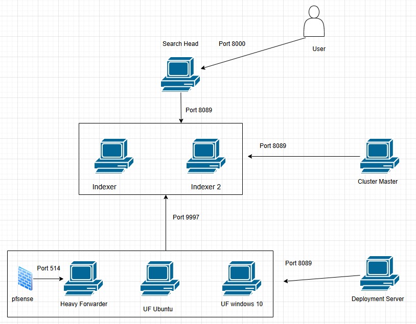

## 1. Sơ đồ kiến trúc



## 2. Triển khai

### 2.1 Cấu hình trên Ubuntu Server

- Máy này sẽ chạy Docker chứa 5 máy Search Head, Indexer, Cluster Master, Deployment Server.
  [docker-compose.yml](docker-compose.yml)
  ```powershell
  docker-compose up -d #lệnh khởi động toàn bộ các container
  docker-compose exec <tên_dịch_ vụ> bash #lệnh vào cli của một container cụ thể
  docker-compose stop #tạm dừng container
  docker-compose down #tắt toàn bộ container
  ```
- Mở các port cần thiết trên firewall
  ```powershell
  sudo ufw allow 8000,8001,8089,8090,9997,9998/tcp
  sudo ufw allow 514/udp
  ```
- Cấu hình trên máy cluster master, truy cập giao diện web splunk trên máy cluster.
  - Tạo manager node (master node), vào Setting →
    
    
  - Tạo các index `win_sec` `win_sys` `win_app` `sysmon` `nix_auth` `nix_sys` `pfsense`

    ```powershell
    docker exec -u splunk splunk-master bash -c 'cat <<EOF > /opt/splunk/etc/master-apps/_cluster/local/indexes.conf
    [win_sec]
    repFactor = auto
    homePath   = \$SPLUNK_DB/win_sec/db
    coldPath   = \$SPLUNK_DB/win_sec/colddb
    thawedPath = \$SPLUNK_DB/win_sec/thaweddb

    [win_app]
    repFactor = auto
    homePath   = \$SPLUNK_DB/win_app/db
    coldPath   = \$SPLUNK_DB/win_app/colddb
    thawedPath = \$SPLUNK_DB/win_app/thaweddb

    [sysmon]
    repFactor = auto
    homePath   = \$SPLUNK_DB/sysmon/db
    coldPath   = \$SPLUNK_DB/sysmon/colddb
    thawedPath = \$SPLUNK_DB/sysmon/thaweddb

    [nix_auth]
    repFactor = auto
    homePath   = \$SPLUNK_DB/nix_auth/db
    coldPath   = \$SPLUNK_DB/nix_auth/colddb
    thawedPath = \$SPLUNK_DB/nix_auth/thaweddb

    [nix_sys]
    repFactor = auto
    homePath   = \$SPLUNK_DB/nix_sys/db
    coldPath   = \$SPLUNK_DB/nix_sys/colddb
    thawedPath = \$SPLUNK_DB/nix_sys/thaweddb

    [pfsense]
    repFactor = auto
    homePath   = \$SPLUNK_DB/pfsense/db
    coldPath   = \$SPLUNK_DB/pfsense/colddb
    thawedPath = \$SPLUNK_DB/pfsense/thaweddb
    EOF'
    ```

  - Push các index trên máy Cluster Master này xuống các máy Indexer, vào **Configuration Bundle Actions** và ấn Push, hoặc gõ lệnh sau
    ```powershell
    docker exec -u splunk splunk-master /opt/splunk/bin/splunk apply cluster-bundle --answer-yes -auth admin:Admin@123
    ```

### 2.2 Cấu hình trên UF Ubuntu

- Tải file `.deb` Splunk Universal Forwarder cho Linux
  ```powershell
  sudo dpkg -i splunkforwarder-*.deb
  sudo /opt/splunkforwarder/bin/splunk start --accept-license
  sudo /opt/splunkforwarder/bin/splunk enable boot-start
  ```
- Trỏ về DS
  ```powershell
  /opt/splunkforwarder/bin/splunk set deploy-poll 192.168.60.20:8090
  ```
- Cấu hình input.conf và output.conf
  - Mở file `/opt/splunkforwarder/etc/system/local/outputs.conf`

    ```powershell
    [tcpout]
    defaultGroup = default-autolb-group

    [tcpout:default-autolb-group]
    server = 192.168.60.20:9997, 192.168.60.20:9998
    ```

  - Mở file `/opt/splunkforwarder/etc/system/local/inputs.conf`
    ```powershell
    [monitor:///var/log/auth.log]
    disabled = false
    index = nix_auth
    sourcetype = sys_log
    ```

- Cấp quyền cho UF đọc file hệ thống
  ```powershell
  sudo chmod 644 /var/log/auth.log
  ```

### 2.3 Cấu hình trên UF Windows 10

- Cài sysmon, tải cấu hình `sysmonconfig-export.xml`
- Cài Splunk Universal Forwarder for Windows
- Trỏ về máy Deployment Server
  ```powershell
  cd "C:\Program Files\SplunkUniversalForwarder\bin"
  splunk.exe set deploy-poll 192.168.60.20:8090
  ```
- Cấu hình Input.conf và output.conf
  - `C:\Program Files\SplunkUniversalForwarder\etc\system\local\outputs.conf`

    ```powershell
    [tcpout]
    defaultGroup = default-autolb-group

    [tcpout:default-autolb-group]
    server = 192.168.60.20:9997, 192.168.60.20:9998
    ```

  - `C:\Program Files\SplunkUniversalForwarder\etc\system\local\inputs.conf`

    ```powershell
    [WinEventLog://Security]
    disabled =0
    index = win_sec
    sourcetype = WinEventLog:Security

    [WinEventLog://System]
    disabled =0
    index = win_sys
    sourcetype = WinEventLog:System

    [WinEventLog://Application]
    disabled =0
    index = win_app
    sourcetype = WinEventLog:Application

    [WinEventLog://Microsoft-Windows-Sysmon/Operational]
    disabled =0
    index = sysmon
    sourcetype = WinEventLog:Microsoft-Windows-Sysmon/Operational
    ```

### 2.3 Tải và cấu hình pfsense

- Tải file iso pfsense, có thể vào trang này tải cho nhanh
  [https://pinguin.dinus.ac.id/iso/pfSense/iso/](https://pinguin.dinus.ac.id/iso/pfSense/iso/)
- Cài máy vm FreeBSD và đưa file iso pfsense vào
- Cài 2 card mạng
  - Adapter 1: Để chế độ Bridged (Làm cổng WAN - để ra Internet và nói chuyện với máy Docker).
  - Adapter 2: Để chế độ LAN Segment/Host-only (Làm cổng LAN - để quản lý các máy ảo khác).
- Khi cài đặt xong pfsense sẽ cấp cho ip WAN để truy cập vào giao diện web, với username và password mặc định là `admin` và `pfsense`
  
- Cấu hình trên giao diện web
  
- Bỏ tích 2 ô này vì nó sẽ chặn dữ liệu từ máy thật tới
  
- Cấu hình đẩy Log (Syslog):
  - Vào Status > System Logs > Settings.
  - Cuộn xuống mục Remote Logging Options.
  - Tích vào Enable Remote Logging.
  - Tại Remote log servers, nhập IP của máy Heavy Forwarder và port 514
  - Chọn nội dung log cần gửi (Firewall Events và System Events).

### 2.4 Cấu hình máy Heavy forwarder

- Tạo một vm Ubuntu server và tải Splunk Enterprise.
- Cấu hình nhận log từ pfSense:
  1. Truy cập Web giao diện của HF.
  2. Vào Settings > Data Inputs > UDP.
  3. Bấm New, nhập port `514`, chọn Sourcetype là `syslog`.
- Cấu hình đẩy log về Indexers (Docker):
  1. Vào Settings > Forwarding and receiving.
  2. Tại mục Configure forwarding, bấm Add new.
  3. Nhập địa chỉ các Indexer trong Docker: `192.168.60.20:9997`, `192.168.60.20:9998`.
  4. Lưu lại. Bây giờ log từ pfSense sẽ đi qua HF để được xử lý trước khi ném vào các Indexer.
